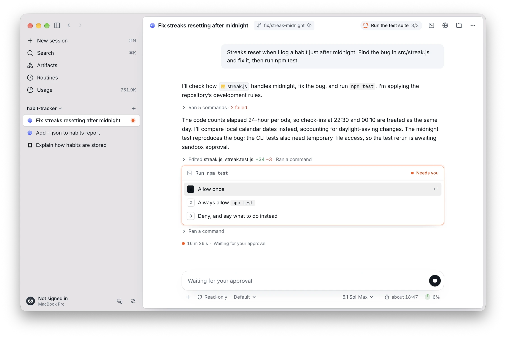

<div align="center">

<h1>
  <picture>
    <source media="(prefers-color-scheme: dark)" srcset="./assets/lockup-horizontal-dark.svg">
    
  </picture>
</h1>

[](https://github.com/KettuAI/Kettu/releases/latest)
[](https://github.com/KettuAI/Kettu/releases)
[](https://github.com/KettuAI/Kettu/releases/latest)
[](#agents)
[](./LICENSE)

<h3>Beauty is productivity.</h3>

All your coding agents, side by side in one window.

[**Download**](https://github.com/KettuAI/Kettu/releases/latest) · [Website](https://www.kettu.sh) · [Docs](https://www.kettu.sh/docs/) · [Roadmap](./ROADMAP.md) · [Feedback](https://github.com/KettuAI/Kettu/issues/new/choose) · [简体中文](./README.zh-CN.md)

</div>

<picture>
  <source media="(prefers-color-scheme: dark)" srcset="./assets/screenshot-dark.webp">
  
</picture>

> [!NOTE]
> Kettu is an early preview that changes quickly. Please [report](https://github.com/KettuAI/Kettu/issues) what you find.

## Features

### Sessions

<table>
<tr>
<td width="33%" valign="top"><br><b>46 agents</b><br>Claude Code, Codex, OpenCode, Pi and more, with your own installs and accounts.</td>
<td width="33%" valign="top"><br><b>Parallel sessions</b><br>The sidebar shows which one is working, waiting for you or done.</td>
<td width="33%" valign="top"><br><b>One-key approvals</b><br>Allow or deny a command or a file change with one key.</td>
</tr>
<tr>
<td width="33%" valign="top"><br><b>Question cards</b><br>Answer an agent's questions one by one in a single card.</td>
<td width="33%" valign="top"><br><b>Plans</b><br>The agent's plan and progress sit in the top bar.</td>
<td width="33%" valign="top"><br><b>Subagents</b><br>Shown under their session, where you answer their requests too.</td>
</tr>
<tr>
<td width="33%" valign="top"><br><b>Queue and steer</b><br>Queue your next message while the agent works, or steer it mid-turn.</td>
<td width="33%" valign="top"><br><b>Attachments</b><br>Paste images, attach files and folders, or mention a file with <code>@</code>.</td>
<td width="33%" valign="top"><br><b>Models and modes</b><br>Pick the model, reasoning and mode by the composer, and see how full the context is.</td>
</tr>
<tr>
<td width="33%" valign="top"><br><b>Forks</b><br>Branch a new session off any reply.</td>
<td width="33%" valign="top"><br><b>Notifications</b><br>Know when a session needs you.</td>
<td width="33%" valign="top"><br><b>Usage</b><br>Tokens and cost by day, model and project, and your plan limits where the agent reports them.</td>
</tr>
</table>

### Workbench

<table>
<tr>
<td width="33%" valign="top"><br><b>Diffs</b><br>See which files the agent changed and how.</td>
<td width="33%" valign="top"><br><b>Files</b><br>Read, preview and edit project files in tabs.</td>
<td width="33%" valign="top"><br><b>Terminal</b><br>Every session has its own.</td>
</tr>
<tr>
<td width="33%" valign="top"><br><b>Git</b><br>The branch, changes and pull request checks.</td>
<td width="33%" valign="top"><br><b>Built-in browser</b><br>Agents open pages, click, type and take screenshots; take over at any time.</td>
<td width="33%" valign="top"><br><b>Artifacts</b><br>Pages, documents and slides the agent makes, to comment on, edit and export to Word and PowerPoint.</td>
</tr>
<tr>
<td width="33%" valign="top"><br><b>Routines</b><br>Run an agent on a schedule; every run is kept as a session.</td>
<td width="33%" valign="top"><br><b>Search</b><br>One command palette for sessions, artifacts, routines, projects, settings and actions.</td>
<td width="33%" valign="top"><br><b>Shortcuts</b><br>Keyboard shortcuts for the common actions.</td>
</tr>
</table>

### Other devices

End-to-end encrypted, straight over your own network.

<table>
<tr>
<td width="33%" valign="top"><br><b>Phone and tablet</b><br>Pair with a QR code and carry on in the browser, with no app to install.</td>
<td width="33%" valign="top"><br><b>Another computer</b><br>Use this computer's sessions from Kettu on another one.</td>
<td width="33%" valign="top"><br><b>Development machines</b><br>Add one by its SSH address.</td>
</tr>
</table>

### Looks

<table>
<tr>
<td width="33%" valign="top"><br><b>Light and dark</b><br>Both modes, with the frosted macOS sidebar.</td>
<td width="33%" valign="top"><br><b>Themes</b><br>From a file or the online catalog.</td>
<td width="33%" valign="top"><br><b>Languages</b><br>English and Simplified Chinese.</td>
</tr>
</table>

### Coming soon

<table>
<tr>
<td width="33%" valign="top"><br><b>Computer use</b><br>Agents operate the apps on your computer.</td>
<td width="33%" valign="top"><br><b>iOS Simulator and Android Emulator</b><br>On screen in Kettu, for you and the agent to use.</td>
<td width="33%"></td>
</tr>
</table>

## Privacy

<table>
<tr>
<td width="33%" valign="top"><br><b>No telemetry</b><br>Your sessions, code and files stay on your own computers.</td>
<td width="33%" valign="top"><br><b>Hands off your credentials</b><br>Kettu keeps no copy of your agents' credentials.</td>
<td width="33%" valign="top"><br><b>Account optional</b><br>Kettu works without a Kettu account.</td>
</tr>
</table>

## Install

Download from [Releases](https://github.com/KettuAI/Kettu/releases/latest):

- **macOS** (Apple silicon): the `.dmg`
- **Windows**: the `setup.exe`. It is not signed yet, so when SmartScreen appears, choose **More info**, then **Run anyway**.
- **Linux**: the `.AppImage`; make it executable and run it. It needs FUSE 2 (`libfuse2`, or `libfuse2t64` on Ubuntu 24.04 and later).

On a server or development machine ([docs](https://www.kettu.sh/docs/devices/daemon/)):

```sh
curl -fsSL https://kettu.sh/install | sh
```

## Agents

<details>
<summary><b>All 46 agents</b></summary>

|                                                                             |                                                       |                                                                                     |                                                          |
| --------------------------------------------------------------------------- | ----------------------------------------------------- | ----------------------------------------------------------------------------------- | -------------------------------------------------------- |
| [Claude Code](https://github.com/anthropics/claude-code)                    | [Codex](https://github.com/openai/codex)              | [OpenCode](https://opencode.ai)                                                     | [Pi](https://pi.dev)                                     |
| [fast-agent](https://fast-agent.ai)                                         | [Minion Code](https://github.com/femto/minion-code)   | [Auggie CLI](https://github.com/augmentcode/auggie)                                 | [Codebuddy Code](https://www.codebuddy.cn/cli/)          |
| [DeepAgents](https://docs.langchain.com/oss/javascript/deepagents/overview) | [DimCode](https://dimagent.cn/)                       | [Dirac](https://dirac.run)                                                          | [GLM Agent](https://github.com/stefandevo/glm-acp-agent) |
| [Nova](https://www.compassap.ai/portfolio/nova.html)                        | [Qoder CLI](https://qoder.com)                        | [siGit Code](https://github.com/getsigit/sigit)                                     | [Agoragentic](https://agoragentic.com)                   |
| [Autohand Code](https://www.autohand.ai/cli/)                               | [Cursor](https://cursor.com/docs/cli/acp)             | [Kimi Code CLI](https://moonshotai.github.io/kimi-cli/)                             | [Amp](https://ampcode.com)                               |
| [goose](https://block.github.io/goose/)                                     | [Kilo Code](https://kilo.ai)                          | [Gemini CLI](https://github.com/google-gemini/gemini-cli)                           | [GitHub Copilot](https://github.com/github/copilot-cli)  |
| [Qwen Code](https://github.com/QwenLM/qwen-code)                            | [Grok](https://x.ai/cli)                              | [Cline](https://cline.bot/cli)                                                      | [Factory Droid](https://factory.ai/product/cli)          |
| [OMP (Oh My Pi)](https://omp.sh)                                            | [Hermes Agent](https://hermes-agent.nousresearch.com) | [Muse Code](https://dev.meta.ai)                                                    | [CodeWhale](https://codewhale.net)                       |
| [Bob](https://bob.ibm.com)                                                  | [MiniMax Code](https://agent.minimax.io)              | [Harn](https://harnlang.com)                                                        | [Kimchi](https://kimchi.dev)                             |
| [Google Antigravity](https://antigravity.google)                            | [Devin](https://docs.devin.ai/cli)                    | [Cortex Code](https://docs.snowflake.com/en/user-guide/cortex-code/cortex-code-cli) | [Corust Agent](https://corust.ai)                        |
| [crow-cli](https://github.com/crow-cli/crow-cli)                            | [Junie](https://junie.jetbrains.com)                  | [Mistral Vibe](https://github.com/mistralai/mistral-vibe)                           | [Poolside](https://poolside.ai)                          |
| [Stakpak](https://stakpak.dev)                                              | [VT Code](https://github.com/vinhnx/VTCode)           |                                                                                     |                                                          |

</details>

Missing an agent you use? [Tell us](https://github.com/KettuAI/Kettu/issues/new/choose).

## Feedback

Open an [issue](https://github.com/KettuAI/Kettu/issues/new/choose) in any language. Security problems go through [SECURITY.md](./SECURITY.md). To build Kettu yourself, see [CONTRIBUTING.md](./CONTRIBUTING.md).

## License

[Apache-2.0](./LICENSE)
